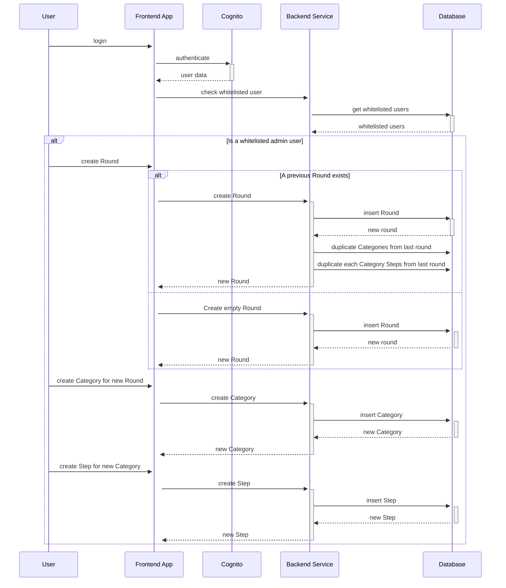

# Optimism Retro Impact Guidelines - WakeUp Labs

Welcome to the [WakeUp Labs](https://www.wakeuplabs.io/) Optimism Retro Impact Guidelines web application. This project aims to update and expand the **Optimism Impact Evaluation Framework** to make it more user-friendly and accessible to the community.

For more details about the application's requirements, check out the [Mission Request](https://gov.optimism.io/t/ready-to-vote-making-impact-evaluation-accessible/7489).

## Introduction

The application streamlines the evaluation of project proposals by presenting evaluation criteria in a clear and intuitive interface. It guides users through the evaluation process, ensuring they understand the criteria for each project category and the key factors to consider during assessment. Additionally, it allows users to review past evaluation criteria.

For administrators, the application offers an in-place editor that enables them to create, update, and delete evaluation criteria while visualizing changes in real time.

This project is fully open source and licensed under MIT.

## Key Concepts

### Round

A round represents a specific time period during which evaluation criteria are applied. Each round contains a set of criteria that evaluators use to assess projects. When a new round is created, the system can copy data from a previous round to maintain consistency.

### Category

A project category defines a type of project under evaluation. Each category groups similar projects and determines the criteria used for assessment within that category.

### Steps

Evaluation steps define the structured criteria for assessing a project within a specific category. Each step represents a different aspect of the evaluation process and helps guide users through the assessment.

## How It Works

### Creating Evaluation Criteria as an Administrator

1. **Log In as an Admin** – Only whitelisted users from our database can access the admin mode.
2. **Create a Round** – Administrators create a round, which sets the evaluation criteria for a specific time period. If a previous round exists, the application copies its data into the new round.
3. **Create a Project Category** – Once a round is created, administrators must define a project category.
4. **Create Evaluation Steps** – Within each category, administrators can add one or more steps, each containing specific evaluation criteria to guide users through the assessment process.

### Process diagram



## How to Run Locally

### System Requirements

- Node.js: v20.18
- pnpm: v9.9.0
- PostgreSQL: v17

### Setup Steps

1. **Create a Database** – Set up an empty database in your local PostgreSQL instance.
2. **Configure Environment Variables**
   - Add a `.env` file in the `prisma` package with the following variables:
     ```
     DB_URL=<local_postgresql_db_url>
     DB_URL_NON_POOLING=<local_postgresql_db_url_non_polling>
     ```
   - Add a `.env` file in the `api` package with the following variables:
     ```
     NODE_ENV=development
     PORT=<api_port>
     DB_URL=<local_postgresql_db_url>
     DB_URL_NON_POOLING=<local_postgresql_db_url_non_polling>
     ```
   - Add a `.env` file in the `web` package with the following variables:
     ```
     VITE_API_URL=http://localhost:<api_port>/api
     ```
3. **Install Dependencies** – Run the following command in the root of the project:
   ```
   pnpm i
   ```
4. **Run Database Migrations** – Apply database migrations using:
   ```
   pnpm db:migrate
   ```
5. **Start the Application** – Launch the application with:
   ```
   pnpm dev
   ```
   By default, the application will start on port 5173.
